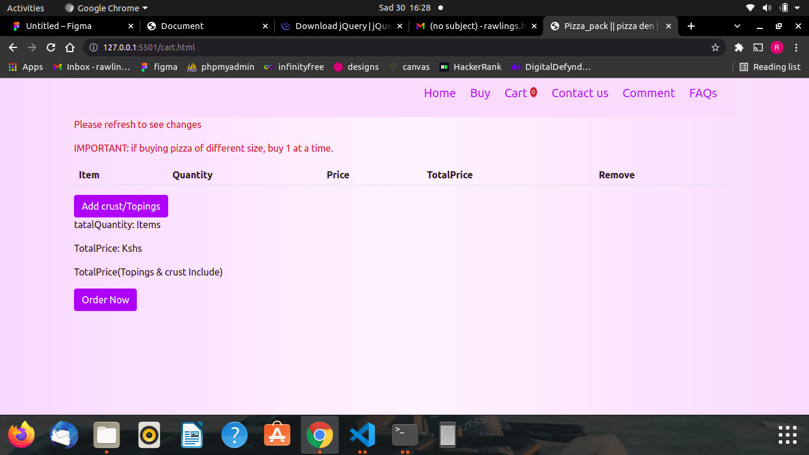

## PIZZA DEN

pizza den is a website of a local pizza supplier who makes and sells pizza to their clients 
around Nairobi.
## Author
  Rawlings Otieno Uhuru
## Technology Used
  HTML
  CSS
  JAVASCRIPT
  JQUERY
  BOOTSTRAP
## How it works
 A customer places an order, add pizza to cart, allows selecting more than one pizza.
 The customer then is allowed to add the topings and crust of desire.
 Piza comes in three size, medium, large and small. a customer can specify.
 When done, he/she can choose a methord of delivery.
### Images

